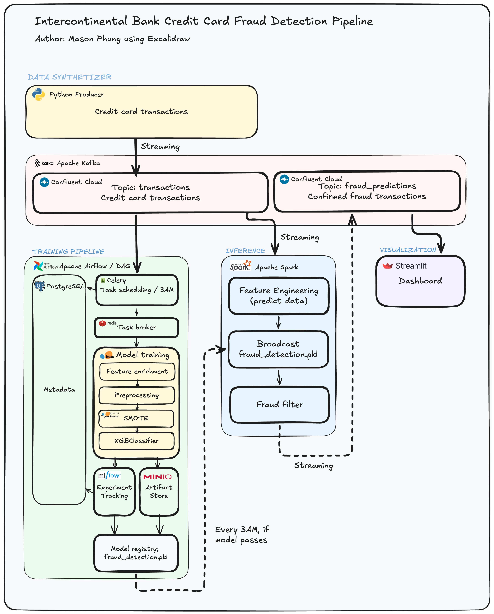

# Real-Time Fraud Detection System


An end-to-end, production-grade real-time fraud detection system built on an event-driven architecture. The system continuously ingests financial transactions via Apache Kafka, applies ML inference in real time using Spark Structured Streaming, and runs a nightly Airflow retraining pipeline to keep the model current — all orchestrated across 14 containerized services.

---

## Business Context

**Intercontinental Bank** is a simulated major Australian bank holding approximately 20% of the domestic credit card market — comparable to ANZ or Westpac. Based on published RBA and ASIC industry data, the bank manages roughly **2.44 million credit card accounts** and processes approximately **65.88 million transactions per month** at an average value of $123.

Credit card fraud represents a compounding loss: each fraudulent transaction triggers not only the transaction loss itself but also network chargeback and dispute-processing fees (~$15/incident). At the industry baseline fraud rate of **0.357%**, the bank faces approximately **235,000 fraud attempts per month** — making early, accurate, automated detection a direct revenue protection priority.

---

## Problem Statement & Business Questions

**Problem:** Traditional rule-based fraud detection systems generate excessive false positives, operate in batch mode, and cannot adapt to evolving fraud patterns without manual rule updates. The bank needs a system that flags fraud in real time, learns continuously from new data, and minimises false alerts that block legitimate customer transactions.

**Questions this system is built to answer:**

1. Can fraudulent transactions be detected within milliseconds of being initiated — before the payment clears?
2. Which fraud patterns (account takeover, card testing, merchant collusion, geographic anomaly) are most prevalent and how do they trend over time?
3. Can precision be held high enough (>95%) to avoid material disruption to legitimate customer spend?
4. Does a daily automated retraining cycle keep the model performant as fraud patterns shift?
5. What is the quantifiable monthly financial impact of automated real-time detection at this scale?

---

## Key Results

### Model Performance

| Metric | Value |
|---|---|
| Precision | **97.87%** |
| Recall | **41.07%** |
| F1 Score | ~0.58 |
| Class Imbalance Handling | SMOTE (post-split) |
| Hyperparameter Objective | F2 Score (recall-weighted) |

> **Why F2?** In fraud detection the cost of a missed fraud (false negative) materially exceeds the cost of a false alert (false positive). The hyperparameter search optimises F2 (β=2), which weights recall twice as heavily as precision.

> **Why high precision over recall?** The 97.87% precision guardrail ensures fewer than 3 in 100 flagged transactions are legitimate — protecting the customer experience while the recall ceiling is pushed upward with each retraining cycle.

### Business Impact at Intercontinental Bank Scale

| Metric | Value |
|---|---|
| Monthly transactions processed | 65.88 million |
| Monthly fraud attempts (0.357% rate) | ~235,191 |
| Monthly fraud instances blocked (41.07% recall) | **~96,593** |
| Savings per blocked instance ($123 txn + $15 chargeback) | $138 |
| **Estimated monthly cost savings** | **$13.33 Million** |
| False positive rate | < 2.13% |

---

## Architecture



*I know this look like AI-generated but I made the diagram manually*

The system is built around **Kafka as the sole integration layer**: both the training and inference services consume from the same `transactions` topic independently, fully decoupling their lifecycles.

| Stage | Component | Role |
|---|---|---|
| Data Production | `producer/` | Simulates synthetic transaction stream → Kafka |
| Event Streaming | Apache Kafka (Confluent Cloud) | Durable, replayable message bus |
| Real-time Inference | Spark Structured Streaming | Sub-200ms ML inference via Pandas UDF |
| Model Training | Airflow DAG (daily, 03:00 UTC) | SMOTE + XGBoost + hyperparameter tuning |
| Experiment Tracking | MLflow + MinIO | Model versioning, artifact storage |
| Predictions Store | PostgreSQL 16 | Persists fraud predictions for dashboarding |
| Monitoring | Streamlit Dashboard | Real-time KPIs, pattern analytics, model health |

---

## Tech Stack

| Layer | Technology |
|---|---|
| Event Streaming | Apache Kafka (Confluent Cloud, SASL_SSL) |
| Stream Processing | Apache Spark 3.5.4 (Structured Streaming + Pandas UDF) |
| ML Framework | XGBoost + scikit-learn + imbalanced-learn (SMOTE) |
| Training Orchestration | Apache Airflow 3.0.2 (CeleryExecutor) |
| Experiment Tracking | MLflow + MinIO (S3-compatible artifact store) |
| Task Broker | Redis |
| Metadata Store | PostgreSQL 16 |
| Dashboard | Streamlit + Plotly |
| Containerisation | Docker / Docker Compose (14 services) |

---

## Fraud Patterns Simulated & Detected

The synthetic producer simulates four realistic fraud archetypes, each with distinct transaction signatures that the system detects via rule-based classification at query time:

| Pattern | Signal | Producer Weight |
|---|---|---|
| **Card Testing** | Micro-transactions (< $2) probing card validity | Low |
| **Merchant Collusion** | High-value transactions (> $3,000) at high-risk merchants | Medium |
| **Geographic Anomaly** | Transactions from high-risk countries (RU, CN, NG, GB) | Medium |
| **Account Takeover** | Elevated spend (> $500) inconsistent with user history | High |

---

## Pipeline Overview

### 1 · Data Production (`src/producer/`)
Continuously publishes synthetic credit card transactions to the Kafka topic `transactions`. Simulates realistic fraud patterns with configurable weights and injects engineered signals (transaction velocity, time-since-last-transaction, high-risk merchant flags).

### 2 · Daily Model Training (`src/dags/`)
Triggered at **03:00 UTC** by an Airflow DAG with three sequential tasks:

```
validate_environment >> execute_training >> cleanup
```

- **validate_environment** — asserts `config.yaml` and `.env` are readable before consuming compute
- **execute_training** — consumes the full Kafka topic history, engineers features, runs SMOTE inside a `Pipeline` (post train/test split), tunes XGBoost with F2-score objective, evaluates, and registers the model in MLflow
- **cleanup** — removes temporary `.pkl` artefacts to keep container storage lean

### 3 · Real-time Inference (`src/inference/`)
A persistent Spark Structured Streaming job that:
1. Reads from the `transactions` Kafka topic continuously
2. Engineers features (transaction velocity, time delta, amount ratios) in-stream
3. Applies a **broadcasted XGBoost model** via a struct-returning `pandas_udf` to output both `fraud_probability` and `prediction` in a single pass
4. Uses `foreachBatch` to dual-sink confirmed fraud events: back to a Kafka output topic **and** to `fraud_predictions` in PostgreSQL

> **Broadcast pattern:** The model is deserialised once per Spark executor (not per task), minimising overhead at throughput scale.

### 4 · Streamlit Dashboard (`src/dashboard/`)
Four-page monitoring interface running on port **8501**:

| Page | Content |
|---|---|
| Overview | Live KPIs, hourly transaction volume, system health indicators |
| Live Feed | Paginated fraud predictions table with pattern colour-coding |
| Pattern Analytics | Donut breakdown, time series trends, top merchants, country distribution |
| Model Health | MLflow model version, metric trends across training runs, confusion matrix + PR curve |

---

## Project Structure

```
fraud_transaction_detection/
├── docs/
│   ├── architecture.png          # System architecture diagram
│   └── data_dictionary.html      # Feature definitions
│
├── src/
│   ├── docker-compose.yml        # 14-service orchestration
│   ├── config.yaml               # Centralised config (Kafka, Postgres, MLflow, thresholds)
│   ├── init-multiple-dbs.sh      # PostgreSQL init: airflow / mlflow / fraud_detection DBs
│   │
│   ├── producer/                 # Synthetic transaction stream → Kafka
│   ├── inference/                # Spark Structured Streaming inference service
│   ├── dags/                     # Airflow DAG + training script
│   ├── dashboard/                # Streamlit multi-page dashboard
│   │   ├── app.py
│   │   ├── config.py
│   │   ├── components/           # Reusable chart + card components
│   │   ├── data/                 # PostgreSQL + MLflow data layer
│   │   └── pages/                # 1_overview / 2_live_feed / 3_pattern_analytics / 4_model_health
│   ├── airflow/                  # Airflow Dockerfile + requirements
│   └── mlflow/                   # MLflow server Dockerfile + requirements
│
├── notebooks/                    # Exploratory analysis
├── data/                         # raw / interim / processed / external
└── reports/figures/              # Generated visualisations
```

---

## Quickstart

### Prerequisites
- Docker Desktop installed and running
- Confluent Cloud account with a `transactions` Kafka topic and an API key/secret

### 1 · Configure environment

```bash
cp src/env/.env.example src/.env
# Fill in KAFKA_BOOTSTRAP_SERVERS, KAFKA_API_KEY, KAFKA_API_SECRET
```

### 2 · Start the full stack

```bash
# First run — builds all images and provisions databases
docker compose --profile flower -f src/docker-compose.yml up -d --build
```

> **Note:** `--profile flower` starts the Celery Flower monitoring UI on port 5555.  
> On a fresh volume, `init-multiple-dbs.sh` automatically provisions the `airflow`, `mlflow`, and `fraud_detection` databases.

### 3 · Access services

| Service | URL |
|---|---|
| Streamlit Dashboard | http://localhost:8501 |
| Airflow UI | http://localhost:8080 |
| MLflow UI | http://localhost:5500 |
| MinIO Console | http://localhost:9001 |
| Flower (Celery) | http://localhost:5555 |

### 4 · Trigger the training pipeline

In the Airflow UI, enable and manually trigger the `fraud_detection_training` DAG. The scheduled run fires daily at 03:00 UTC.

### 5 · Stop the stack

```bash
docker compose -f src/docker-compose.yml down        # stop, keep volumes
docker compose -f src/docker-compose.yml down -v     # stop and remove volumes (full reset)
```

---

## Key Design Decisions

| Decision | Rationale |
|---|---|
| **F2 Score for tuning** | Missed fraud costs more than false alerts — β=2 weights recall appropriately |
| **SMOTE after split** | Oversampling inside the pipeline post-split prevents data leakage and ensures evaluation metrics reflect true class distribution |
| **Broadcasted model in UDF** | Deserialises once per executor (not per row), the correct pattern for high-throughput Spark UDF inference |
| **Threshold decoupled from model** | Decision threshold derived post-hoc from the PR curve; re-optimisable without retraining |
| **Kafka as integration layer** | Training and inference consume the same topic independently — lifecycle fully decoupled, no restart required on model update |
| **Struct-returning Pandas UDF** | Outputs `fraud_probability` + `prediction` in a single model pass, avoiding double inference |
| **foreachBatch dual-sink** | Cleanest pattern for writing one stream to multiple destinations (Kafka output + PostgreSQL) |
| **PostgreSQL as dashboard store** | Query-friendly, indexed on `detected_at`, `user_id`, `location`, `merchant` for efficient dashboard aggregations |

---

## References

- [RBA Payments Data — Credit Card Statistics](https://www.rba.gov.au/payments-and-infrastructure/payments-data.html)
- [ASIC — Credit Card Lending in Australia](https://asic.gov.au)
- [XGBoost Documentation](https://xgboost.readthedocs.io)
- [Apache Spark Structured Streaming Guide](https://spark.apache.org/docs/latest/structured-streaming-programming-guide.html)
- [MLflow Model Registry](https://mlflow.org/docs/latest/model-registry.html)
- [imbalanced-learn SMOTE](https://imbalanced-learn.org/stable/references/generated/imblearn.over_sampling.SMOTE.html)
- [Credit Card Debt Statistics 2026](https://www.money.com.au/credit-cards/research-insights/credit-card-statistics)